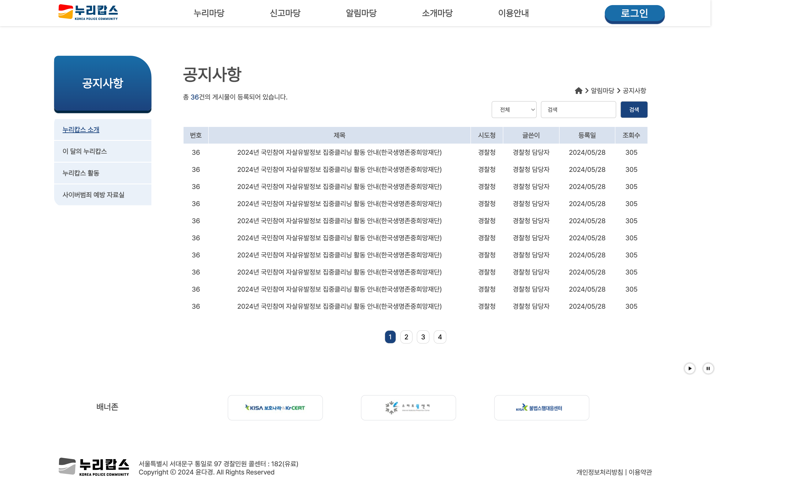
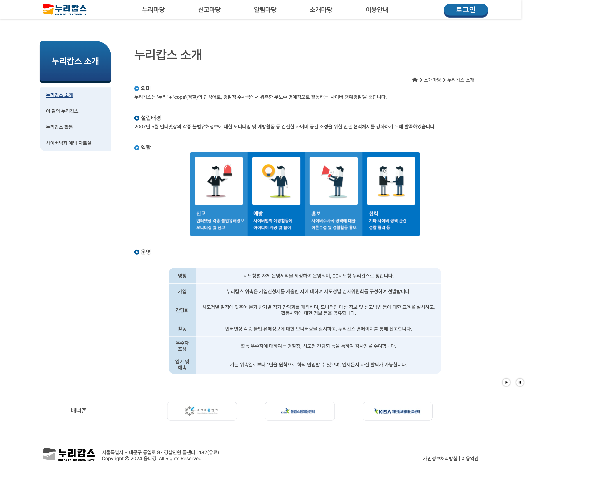

# 제목 - 🚨공공기관 리뉴얼 - 누리캅스👮‍♂️

## 작업자 : 윤다경 

## 제작 기간
- 기획: 3일 (2024년 10월 25일 ~ 2024년 10월 27일)
- 디자인: 5일 (2024년 10월 28일 ~ 2024년 11월 1일)
- 개발: 30일 (2024년 9월 2일 ~ 2024년 11월 11일)

## ⭐️ 프로젝트 설명

### 리뉴얼의 방향성과 신경 쓴 점
- 기존 사이트의 공공사이트임에도 불구하고 favicon이 없거나 웹사이트 검색 시 사이트에 대한 설명이 없는 등 전문적이지 못 하고 그로 인해 신뢰감이 다소 떨어지는 점을 보완하고자 노력하였습니다. 
 
- 기존 사이트의 한 눈에 봤을 때 사이트의 목적에 대해 한 눈에 알기 어렵다는 점을 보완하여 주요 기능들을 눈에 띄게, 사이트의 이용 방법에 대한 이해도와 친숙도를 높이기 위한 레이아웃과 디자인에 힘 썼습니다.  
 
- 전체적으로 업데이트 된 지 오래되어 올드한 디자인과 기능, 로고,아이콘 등을 변경하여 시대에 맞는 트렌디한 느낌을 주고자 하였습니다.
   

### 메인 페이지 
- 대표 기능: 메인 페이지에서 사용한 핵심 기능을 나열. 예를 들어, 슬라이더, 주요 공지사항, 배너 등.
- 사용자 인터페이스: 사용자가 메인 페이지에서 처음으로 접하는 인터페이스의 특징과 핵심 기능들.
- 검색 및 네비게이션 기능: 사용자가 원하는 정보를 쉽게 찾을 수 있도록 돕는 기능들.

### 서브 페이지 기능

- 세부 내용 제공: 서브 페이지에서 제공하는 구체적인 정보나 자료들을 설명.(예를 들어, 서비스 소개, FAQ, 정책 자료)
- 카테고리 별 페이지: 서브 페이지에서 카테고리 별로 나뉘어 있는 기능들, 예를 들어 각 부서 소개, 로그인기능, 문서 다운로드 등

## ⚙️ 개발 환경

- 개발 환경 : 
- 사용 프로그램 :  
- 사용된 기술 :
     

## 📝 페이지 구성

### 메인 페이지

| 섹션1 : 메인비주얼                                                                                                      |
| :---------------------------------------------------------------------------------------------------------------------- |
|  |

| 기존 사이트에서는 시선을 끌 만한 메인이미지와 버튼이 없었던 점을 보완하여 사이트의 분위기와 어울리는 이미지를 제작하여 삽입했습니다.  
 
| 또한 사이트의 주 목적인 신고와 가입 버튼 또한 눈에 잘 띌 수 있도록 위치와 디자인에 신경 썼습니다. 
 

| 섹션2 :   슬라이드 / SNS영역                                                                                            |
| :------------------------------------------------------------------------------------------------------------------------ |
|  |

| 기존 사이트에서 메인 비주얼 포지션이었던 이미지 슬라이드를 경찰청sns와 함께 한 영역으로 묶었습니다.  
 
| 슬라이드 영역 - swiper를 사용해서 제작하였으며슬라이드 이미지에는 마우스 hover 시 이미지가 확대되고 양쪽 화살표 버튼을 클릭하여 이미지를 스와이프 할 수 있습니다. 
 
| SNS 영역의 - 기존 사이트에서는 일관되지 않은 디자인과 업데이트 되지 않은 구 아이콘을 사용하고 있었던 점을 보완하여 트렌드에 맞는 디자인과 업데이트 된 디자인으로 로고를 다시 제작하였습니다. 마우스 hover 시 아이콘이 기울어지는 귀여운 효과 또한 포인트입니다.  
 

| 섹션3 :   알림마당 영역                                                                                            |
| :------------------------------------------------------------------------------------------------------------------------ |
| |

|기존 사이트에서 세로 배치되어 있던 공지사항과 사이버 범죄 예방 자료실을 가로 배치하여 한 영역으로 묶었습니다. 
 
|로그인을 하지 않은 상태에서도 열람이 가능한 알림마당 영역은 2개지만, 안정감과 이용자들의 사이트의 목적에 대한 이해도를 돕기 위하여 
회원만 열람 가능한 "우수 누리캅스" 영역을 부가설명과 함께 가입을 유도할 수 있는 버튼을 제작하여 함께 배치하였습니다.  
 

| 섹션4 : 가입 절차                                                                                                           |
| :----------------------------------------------------------------------------------------------------------------------- |
|  |

| 기존 사이트의 경우, 메인페이지만으로는 이 곳이 어떤 사이트인지 한 눈에 알아보기 어렵다는 단점이 있었습니다. 
 
| 이 점을 보완하여 서브페이지였던 가입 절차를 메인으로 가져와서 사이트의 목적과 가입 절차에 대한 이해도를 높일 수 있게 배치하였습니다. 

 

### 서브페이지

| 서브01 : modal로그인 페이지                                                                                                       |
| :------------------------------------------------------------------------------------------------------------------------ |
|  |

| 사이트의 거의 대부분의 컨텐츠는 회원가입/로그인 이후 이용할 수 있습니다.  
 
| 이용자가 처음 사이트에 들어와 탐색을 할 때 대부분의 컨텐츠에 액세스 시 로그인 페이지로 넘어가게 됩니다.  
 
|이 점을 모달로그인 창으로 뒤로가기가 필요 없이 X아이콘을 눌러 창을 닫을 수 있게 하고 모달 로그인 창 뒤로 열람 중이던 페이지가 그대로 유지되어 이용자의 사이트에 대한 흥미도가 떨어지는 것을 방지하고자 하였습니다. 
또한 로그인 페이지 상단에 회원가입 후 이용 가능하다는 문구와 클릭 시 가입절차로 이동되는 링크를 이용하여 사이트에 대한 이해도를 높일 수 있도록 했습니다. 

 

| 서브02 : 공지사항 페이지                                                                                                       |
| :------------------------------------------------------------------------------------------------------------------------ |
|  |

| 서브02 : 누리캅스 소개 페이지                                                                                                       |
| :------------------------------------------------------------------------------------------------------------------------ |
|  |

 

## 🔗 링크

- [기획서](https://docs.google.com/presentation/d/1Zpxbyy_ZRD2kTOER-9JgWXdObFJ0L3eKos9IG874j-c/edit?usp=sharing)

- [와이어프레임 및 디자인](https://www.figma.com/design/FmZxgS1BKLsLJz2ZnGTEBf/%EA%B3%B5%EA%B3%B5%EA%B8%B0%EA%B4%80-%EB%A6%AC%EB%89%B4%EC%96%BC_%EC%9C%A4%EB%8B%A4%EA%B2%BD?node-id=0-1&t=MRlQXS6cKP7ev2gl-1)

- [리뉴얼 사이트](https://www.nuricops.org/index.do)

    
